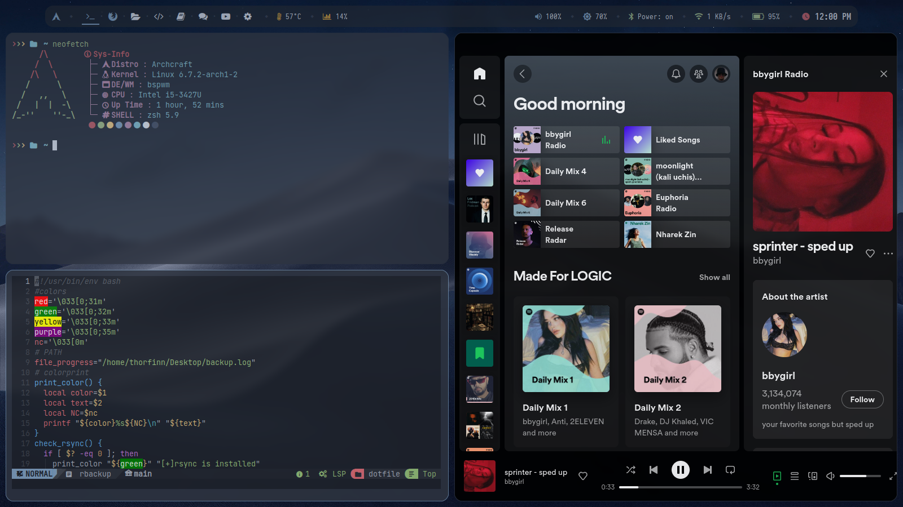

# Customizing Archcraft OS BSPWM Theme with dotfiles

<span style="background-color: #red">*NOTE:*</span> The new changes of my dotfile would be in dir called `current`

This repository contains my personal dotfiles for customizing the default theme of Archcraft OS with BSPWM window manager. The main focus of these dotfiles is to enhance the visual appeal of the OS using Picom for window styling. The customizations include transparent and blurred windows, as well as rounded corners for a sleek and modern look.
## BSPWM preview


## Archcraft OS

Archcraft OS is a lightweight and minimalistic Arch Linux-based distribution that provides a fast and efficient computing environment. It comes pre-configured with BSPWM window manager, which allows for extensive customization and flexibility.

## BSPWM

BSPWM (Binary Space Partitioning Window Manager) is a tiling window manager that arranges windows in a binary tree-like structure. It provides a highly efficient workflow by automatically managing the layout of windows, making it ideal for users who prefer keyboard-centric navigation and window organization.

## Picom for Window Styling

Picom is a compositor for X11 that allows for various window styling effects, including transparency and blur. By using Picom, I have customized the appearance of windows to achieve a visually appealing and modern user interface.
## Customized Features

1. Transparency: Windows are set to be partially transparent, providing a subtle see-through effect, enhancing the overall visual experience.

2. Blurring: Picom enables window blurring, giving a sleek and aesthetically pleasing look to open windows.

3. Rounded Corners: Window corners are rounded, softening the edges and contributing to a more modern and elegant design.

## How to Use the Dotfiles

To apply these customizations to your Archcraft OS BSPWM setup, follow these steps:

1. Clone the repository
```bash
git clone https://github.com/thorfinn/dotfiles

```
2. nstall Picom if you haven't already. Check the Archcraft OS documentation for the appropriate installation method. But mostly Archcraft is using picoman for Customizing windows.

3. copy the config 

```bash
# only for Archcraft users
# better to remove the /theme/default folder just to not face any overright errors
cp -vra dotfiles/bspwm/theme/default/ ~/.config/bspwm/theme/default
```
### **NOTE**
In case you are not an Archcraft user then try to copy the picom config file as well rofi and polybar of course if you are using them.

```bash
cp dotfiles/picom.conf ~/.config/picom.conf

```
## Disclaimer

These dotfiles are my personal customizations and may not suit everyone's preferences. Feel free to modify and adapt them to your liking. Please use them responsibly and at your own risk.

**Note**: Ensure that you have a backup of your existing configuration before applying these dotfiles to avoid any potential issues.

Happy customizing! 🎨


